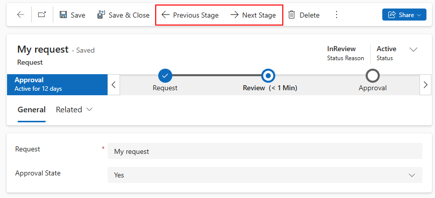
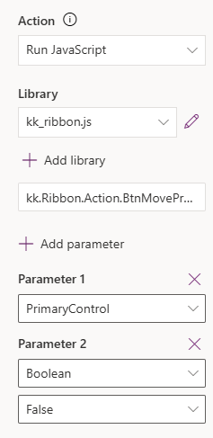

# Business Process Flow With Custom Buttons

**Business Process Flow** in Power Platform guides app users through a sequence of predefined steps, ensuring that all the required fields are completed before progressing to the next stage.

The buttons allowing users to move to the next stage are.. well... **well hidden**.

Good choice? Bad choice?

Perhaps when working with a small group of users, it's manageable to show each person where to find the **Next Stage** / **Previous Stage** buttons. But when you're building an app intended for company-wide use, it becomes an obstacle.

## Custom buttons

That's why it's common to add custom buttons to the toolbar (and to [declutter](https://www.xrmtoolbox.com/plugins/RibbonWorkbench2016/) it while you're at it).

These custom buttons can be shown or hidden (or enabled/disabled) based on specific conditions, such as whether the user has a certain role, the form is completed, or an approver has made a decision.

You may also use these buttons to trigger additional logic, like updating the "Status Reason" field, showing notifications, or even preventing the user from moving to the next stage based on custom conditions.

However, if you take this approach, make sure the **default buttons** cannot be used to bypass this additional logic.

### Disabling / hiding BPF buttons?

It is of course possible to manipulate the DOM of your model-driven apps, but... it's [not supported](https://learn.microsoft.com/en-us/power-apps/developer/model-driven-apps/clientapi/reference). The supported approach is to use the [onPreStageChange](https://learn.microsoft.com/en-us/power-apps/developer/model-driven-apps/clientapi/reference/events/onprestagechange) event to call the `executionContext.getEventArgs().preventDefault()`.

This event runs before the stage changes - whether triggered by a user clicking one of the standard Business Process Flow buttons (i.e. **Next Stage**, **Previous Stage**, or **Set Active Stage**), or by programmatic calls such as `formContext.data.process.moveNext`, `formContext.data.process.movePrevious`, or `formContext.data.process.setActiveStage`.

This means that when implementing custom logic, we need to make sure the custom buttons are allowed to perform the stage transition, while blocking all other requests.

### Gotcha: the "Finish" action

Unfortunately, according to my tests, calling `preventDefault()` in either the `OnPreStageChange` or the `OnProcessStatusChange` will not stop the **Finish** action in Business Process Flow.

I worked around this issue by adding an additional, final stage and immediately completing the flow as soon as that stage is reached.
This stage wouldn’t be used by users - it is there to help finalize the process.

## The design

I made a "plan minimum" solution that covers the most important parts of the process. It consists of two custom buttons and a reusable script that:

- ensures that only custom buttons can move business process flow between stages,
- updates the record's **Status Reason** and **Status** fields according to the current stage,
- calls **rollback** function if required,
- displays notifications,
- automatically **finalizes the last stage**,
- **restarts** the business process flow if **Previous Stage** button is clicked in **Finalized** stgae

This logic is supported by a client-side script used by the form and the custom buttons:

1. In the form's `OnLoad`, an event handler is added for the `onPreStageChange` event.
1. The `onPreStageChange` event handler ensures the request came from the custom buttons. Otherwise the navigation is cancelled using `executionContext.getEventArgs().preventDefault()`.
1. The custom buttons set a `isCustomButton` to `true` to make sure the move to the stage will be allowed. The variable is saved in the browser's **local cache**.
1. The custom buttons handle any additional logic (e.g. set record's fields) and move to the next/previous stage. In case of errors they call rollback functions. Finally, they reset the  `isCustomButton` to `false`.
1. The business process flow is finished by completing the process and setting the record to **Inactive**.

    

1. During process restart, the record is re-activated and the business process flow is moved back to the previous stage.

The code supports both scenarios: with and without automatic completion of the final stage.
When `BtnMoveNext` is called with only one argument (`formContext`), the last stage is completed automatically. To prevent this, call `BtnMoveNext` woith two parameters: `formContext` and `false`.
Make sure to apply the same configuration when calling `BtnMovePrevious` to ensure the process moves to the previous stage (or not) consistently.

| Scenario | **Next Stage** button | **Previous Stage** button |
|----------|---------------|-------------------|
| Auto-complete final stage| `BtnMoveNext(formContext)` | `BtnMovePrevious(formContext)`|
|          | | |
| Do NOT auto-complete| `BtnMoveNext(formContext, false)`|  `BtnMovePrevious(formContext, false)`|
|| ||

## Demo

In order to see this demo in action, download the  packaged solution from [Github](https://github.com/kkazala/Business-Process-Flow-With-Custom-Buttons/releases) and import it to your Power Platform Environment (Dataverse required).

##
